# Bedriftsgrafen.no 📊

**A business intelligence platform tracking 1.1M+ Norwegian companies.**


## Overview

**Bedriftsgrafen** is a full-stack analytics platform designed to democratize access to Norwegian business data. It aggregates, processes, and visualizes financial data from **Brønnøysundregistrene**, providing real-time insights into the Norwegian economy.

Built with a focus on **performance and efficiency**, the entire stack is optimized to run smoothly on modest hardware while handling a dataset of over **1.1 million companies** and millions of financial records.

## Tech Stack

The project leverages a modern, type-safe, and performance-oriented stack:

- **Frontend**:    
- **Backend**:   
- **Database**:  (with `asyncpg` & Full-Text Search)
- **Infrastructure**:   

## Key Features

### Interactive Dashboard
- **Real-time KPIs**: Tracks Total Revenue, Profitability, and Solvency across the entire dataset.
- **Industry Benchmarking**: Compare any company against its industry peers (NACE 5-digit) with percentile rankings.
- **Visualizations**: Dynamic charts powered by `Recharts` showing trends over time.
- **Responsive Design**: Fully optimized for desktop and mobile using Tailwind CSS.

### Advanced Search Engine
- **Full-Text Search**: Custom PostgreSQL FTS implementation supporting Norwegian language stemming.
- **Instant Filtering**: Filter 1.1M+ records by Industry (NACE), Employee Count, Revenue, and Foundation Date in milliseconds.
- **Vector Search**: (Experimental) Semantic search capabilities for finding related businesses.

### High-Performance Sync Engine
- **Robust Data Pipeline**: Custom Python service that synchronizes data from Brønnøysundregistrene.
- **Concurrency Control**: Optimized `asyncio` implementation with rate limiting and backoff strategies to respect API limits.
- **Resilience**: Handles API outages, timeouts, and data inconsistencies gracefully with automatic recovery.

## Architecture

The system is designed as a microservices-style architecture containerized with Docker:

```mermaid
graph TD
    Client["Frontend (React)"] <-->|REST API| API["Backend (FastAPI)"]
    API <-->|"Async Queries"| DB[("PostgreSQL")]
    API -->|"Background Tasks"| Sync["Scheduler Service"]
    Sync <-->|"Fetch Updates"| External["Brønnøysund API"]
    Sync -->|"Upsert Data"| DB
```



### Optimization Highlights
- **Database**: Heavy use of **Materialized Views** and **Generated Columns** for instant KPI calculations.
- **Caching**: Multi-level caching (Frontend React Query + Backend LRU Cache) to minimize database load.
- **Build**: Vite build optimization with **Code Splitting** to ensure fast load times (<1s).

## 👨‍💻 Development

This project demonstrates expertise in:
- **Full-Stack Development**: From database schema design to responsive UI implementation.
- **System Architecture**: Designing for efficiency and reliability.
- **DevOps**: Docker containerization, CI/CD pipelines, and automated health monitoring.
- **AI-Orchestrated Development**: Modern workflow leveraging AI assistance for implementation.

### Standardized Skills
This project uses a rigorous set of **Skills** to standardized workflows for both human and AI developers. These are version-controlled in `.agent/skills/` and enforce:
- **Review Standards**: Lead Architect persona with strict security/performance checks.
- **Commit Conventions**: Conventional commits.
- **Verification**: Mandatory local testing before push.

See [CONTRIBUTING.md](CONTRIBUTING.md) for details.

## Getting Started

### Prerequisites
- Docker & Docker Compose
- Node.js 22+ (for local frontend development)
- Python 3.11+ (for local backend development)

### Quick Start

1. **Clone the repository**
   ```bash
   git clone https://github.com/Bedriftsgrafen/bedriftsgrafen.no.git
   cd bedriftsgrafen.no
   ```

2. **Configure environment**
   ```bash
   cp .env.example .env
   # Edit .env with your database credentials
   ```

3. **Start services**
   
   **Development** (with hot-reload and debugging):
   ```bash
   docker compose up -d
   ```
   
   **Production** (optimized build):
   ```bash
   docker compose -f docker-compose.prod.yml up -d
   ```
   
   See [DOCKER_WORKFLOW.md](docs/DOCKER_WORKFLOW.md) for detailed command reference and workflows.

4. **Access the application**
   - Frontend: http://localhost:5173
   - Backend API: http://localhost:8000
   - API Docs: http://localhost:8000/docs

### Initial Data Import

See [IMPORT_GUIDE.md](IMPORT_GUIDE.md) for detailed instructions on importing company data from Brønnøysundregistrene.

## ⚙️ Configuration

Key environment variables (see `.env.example` for full list):

| Variable | Description | Required |
|----------|-------------|----------|
| `DATABASE_URL` | PostgreSQL connection string | Yes |
| `DATABASE_URL_ASYNC` | Async PostgreSQL connection | Yes |
| `CORS_ORIGINS` | Allowed CORS origins | Yes |
| `PROJECT_ROOT` | Project root directory | No (defaults to pwd) |

## Contributing

Contributions are welcome! Please see [CONTRIBUTING.md](CONTRIBUTING.md) for guidelines.

1. Fork the repository
2. Create a feature branch (`git checkout -b feature/amazing-feature`)
3. Commit your changes (`git commit -m 'Add amazing feature'`)
4. Push to the branch (`git push origin feature/amazing-feature`)
5. Open a Pull Request

## 📄 License

MIT License © 2026 Bedriftsgrafen - see [LICENSE](LICENSE) file for details.
